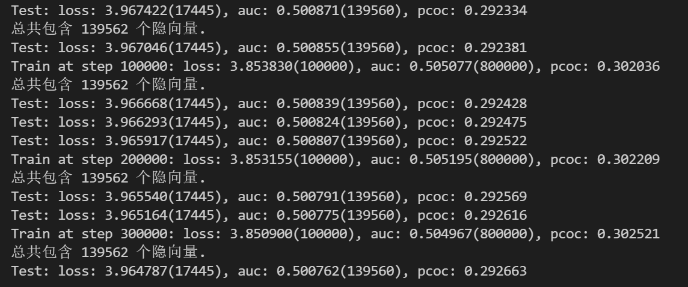
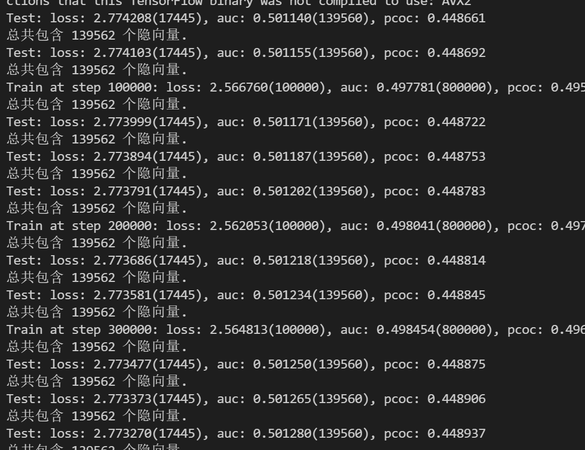

## Project1-使用LFM模型进行电影推荐召回

### 一、主要功能：

使用LFM方法为用户进行电影推荐召回

* 使用movielens rating数据
* model部分策略为MSE，算法为梯度下降
* 召回应用部分使用i2i，u2i两种策略

### 二、代码结构
#### 1.数据预处理 
* 过滤行为过于频繁的用户: 去掉行为数大于2000条的用户;
* 划分训练集和测试集: 取每个用户按时间排序的后两次行为作为测试数据，rating >= 4为正样本，<4为负样本;
* 特征哈希化: 本项目中使用bkdr2hash64特征哈希化方法的主要目的在于统一user_id和movie_id的表示;
* 以**tfrecords**格式保存数据，并模拟真实数据保存为多个文件: 200000条数据为大小上限

#### 2.使用单例模式实现Parameter-Server类：管理参数
* 参数: embedding_dim
* 成员: self.params_server(dict), self.dim
* 方法: pull提取隐向量, push更新隐向量, delete删除对应向量, save保存到文件

#### 3.InputFn类：模拟实际情况数据流，读取多文件，返回batch迭代器
* 方法input_fn: 读取tfrecords文件并解析;从PS中pull隐向量;数据分批;设置迭代器return iterator,iterator.get_next()

#### 4.model主要部分
##### (1) 定义mf_fn函数:由输入的embedding和label进行预测并计算loss(MSE)
##### (2) 定义setup_graph图结构类：调用mf_fn方法进行预测和loss计算，并进行梯度计算和参数更新
* with tf.compat.v1.variable_scope("net_graph",reuse = is_test)
##### (3) 定义AUCUtils模型评估类：实现reset,add(按批保存结果),cal计算结果,calc_str输出结果
##### (4) 定义train函数：model部分主函数
* 设置参数，定义PS对象，定义InputFn对象、setup_graph对象并绑定，定义AUCUtils对象:
        train_iter, train_inputs = inputs.input_fn(train_file_dir, is_test = False)
        train_dic = setup_graph(train_inputs, embedding_dim, learning_rate, is_test = False)
* 定义_valid_step函数计算测试集上的结果并将参数保存至文件
* 创建对话进行迭代：每轮结果保存到AUCUtils中，并更新ps中隐向量; 定义每迭代train_log_steps次输出一次训练集上的结果，每迭代test_log_steps输出一次测试集上的结果：with tf.compat.v1.Session() as sess

#### 5.应用：召回

### 三、学习点小结：
* tfrecords文件格式设置，保存并解析;

* python单例模式类实现

* ps,inputfn,setup_graph,AUCUtils类的设计和连接(inputfn中返回数据迭代器)

* 创建tf会话run进行迭代 (tfv1)

* 召回策略：i2i,u2i...

  

### 四、发现问题和改进：
* 改进1：计算loss的时候将没有出现过的id随机取值然后进行计算，而如果迭代次数过早就这样看test集结果的话无意义，而且也不会有太大提高。因为大部分id都没见过，对比无意义。且本项目中模拟使用实时batch流不断更新参数，并没有设置epoch的概念；因此更改了test_log_steps参数为37525, 所有训练数据都训练一遍再计算测试集上的效果，个人认为更加合理。且test/trainloss都有明显提高

* 改进2-TODO：由于LFM性质是为user/movie训练隐向量，因此在计算loss的时候是不是没出现过的user_id,movie_id不算更合理一些

* 存在问题-TODO：仍然存在问题:loss连续下降但是auc0.5左右太小了，而且也会下降。预估可能是正负样本差距太大几乎7:1有关--修改之后auc有连续提高，但是仍然小，这里只是学习结构，效果有待后续知识积累提高。

* 改进3：将label0-1阈值从3分提高到4，正负样本比较均衡再试一次

  

### 六、实验结果
lr：0.0001一直在下降 但是太慢；且loss下降auc也下降

batch_size = 8
embedding_dim = 8
learning_rate = 0.0001

改进正负样本比例之后：AUC有连续提高，但是还是不大

batch_size = 8
embedding_dim = 8
learning_rate = 0.0001

label划分阈值为4

